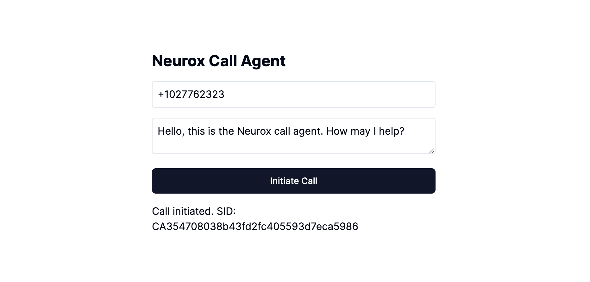
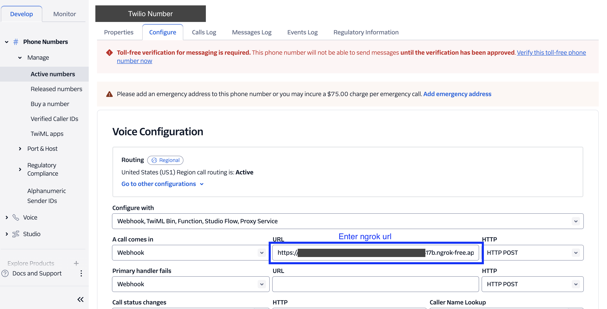

# Neurox Call Agent



This project integrates Twilio and ElevenLabs to create an application that can initiate phone calls and speak custom messages using AI-generated voices.

## Features

- Initiate phone calls using Twilio
- Convert text to speech using ElevenLabs AI voices
- Custom message input through a web interface
- Real-time audio streaming during calls

## Prerequisites

Before you begin, ensure you have met the following requirements:

- Node.js (v14 or later)
- npm (comes with Node.js)
- Twilio account and phone number
- ElevenLabs account and API key
- ngrok for local development

## Installation

1. Clone the repository:

   ```
   git clone https://your-repository-url.git
   cd neurox
   ```

2. Install dependencies:

   ```
   npm install
   ```

3. Create a `.env` file in the root directory with the following content:

   ```
   SERVER_DOMAIN=your-ngrok-url
   PORT=3001
   ELEVENLABS_API_KEY=your-elevenlabs-api-key
   ELEVENLABS_VOICE_ID=your-elevenlabs-voice-id
   TWILIO_AUTH_TOKEN=your-twilio-auth-token
   TWILIO_ACCOUNT_SID=your-twilio-account-sid
   TWILIO_PHONE_NUMBER=your-twilio-phone-number
   ```

   Replace the placeholder values with your actual credentials and settings.

## Usage

1. Start ngrok to expose your local server:

   ```
   ngrok http 3001
   ```

2. In a separate terminal, start the server:

   ```
   npm run dev
   ```

3. **Important:** Each time you start ngrok, it generates a new URL. You need to:

   - Update your `.env` file with the new ngrok URL:
     ```
     SERVER_DOMAIN=https://your-new-ngrok-url.ngrok.io
     ```
   - Update your Twilio phone number's voice webhook URL in the Twilio console:
     - Go to the Twilio Console
     - Navigate to Phone Numbers > Manage > Active numbers
     - Click on your Twilio phone number
     - In the "Voice Configuration" section:
       - For "A CALL COMES IN", select "Webhook" from the dropdown
       - In the "URL" field, enter your ngrok URL followed by `/call/incoming`:
         ```
         https://your-new-ngrok-url.ngrok.io/call/incoming
         ```
       - Ensure the HTTP method is set to "HTTP POST"
     - The configuration should look similar to this image:
       
     - Don't forget to save your changes

4. Open the frontend application in your web browser (typically at `http://localhost:3000`)

5. Enter a phone number and a custom message, then click "Initiate Call"

6. The system will initiate a call to the specified number and speak the custom message using the ElevenLabs AI voice

## Troubleshooting

- Ensure all environment variables are correctly set BEFORE running application.
- Check Twilio console for call logs and error messages
- Verify that your ngrok tunnel is active and the URL is up-to-date in both the `.env` file and Twilio console
- If calls are not connecting or you're not hearing the message, double-check that you've updated both the `.env` file and the Twilio webhook URL with the latest ngrok URL
- Make sure you've selected "Webhook" for the "A CALL COMES IN" configuration in Twilio
- Confirm that the HTTP method for the webhook is set to "HTTP POST"
